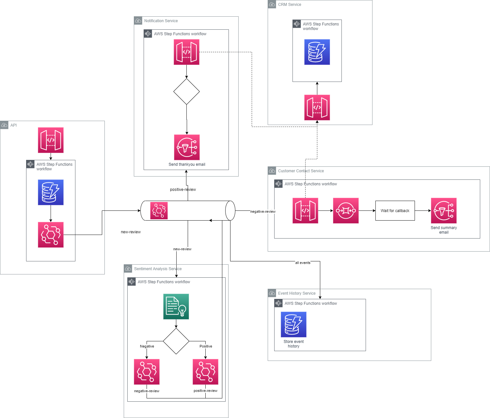

# Event Driven Serverless CDK

This project is a clone from [James Eastham's Event Driven Serverless](https://github.com/jeastham1993/event-driven-serverless-cdk) presented during CDK Day 2022. The codebase is rewritten from C# to TS.

Note: Customer Interaction component is not included in the example.

## Architecture

The intention of this application is to show the art of the possible, that does not necessarily mean this would be replicated directly into a production system. AWS Lambda still has a place in the serverless world, these Step Functions show the possibilities.



The application consists of 6 services:

### API

A storage first API that receives requests from a front-end, stores them durably and publishes an event to notify other services that a new review has been received.

This storage first API utilises the native service integrations between Amazon API Gateway and Step Functions to pass the HTTP request directly to a step functions execution. The workkflow stores the request to DynamoDB and then publishes an event to notify other services that an API request has been received.

### Sentiment Analysis

Service to translate the review to English if not currently in English, analyze the review content and detect the sentiment.

This service demonstrates the true power of Amazon Step Functions. There are native service integrations with Amazon Comprehend and Translate. The workflow is also invoked directly from an Amazon Event Bridge rule.

### Notification Service

Sends email notifications back to the reviewer.


### Add Email

1) Open src/EventDrivenCdk/CustomerContactService/WorkflowStep.cs
2) Add your email address to the AddSubscription line
```
negativeReviewNotification.AddSubscription(new EmailSubscription("", new EmailSubscriptionProps()
```

### Deploy
The entire application can be deployed by running the below command from the root directory.

```
cdk bootstrap
cdk deploy
```

## Test

Below are sample API request bodies you can use to test positive and negative workflows.

Tests can be executed using the API testing tool of your choice. On deployment the CDK project will output the URL endpoint to use. Make a POST request to the root endpoint using the schema below.

### Positive
```json
{
    "reviewIdentifier": "test",
    "emailAddress": "",
    "reviewContents": "This is a great demo of CDK native integrations."
}
```

### Negative
```json
{
  "reviewIdentifier": "test",
  "emailAddress": "eventdrivencdk@gmail.com",
  "reviewContents": "Esta no es una muy buena demostración, viva Lambda"
}
```